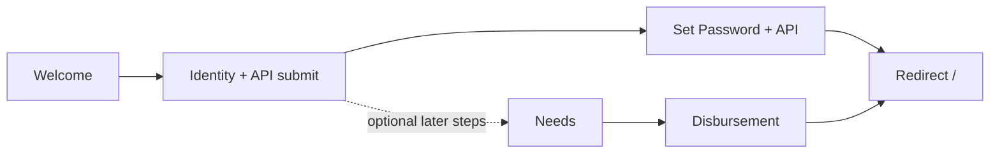
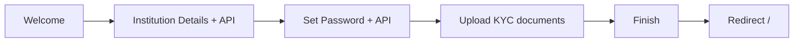

# Beneficiary Registration — Web Implementation Guide

This document is the **web implementation specification** for:

- **Manual** beneficiary registration
- **Institution** registration

It covers UI steps, validation, API contracts, state transitions, and completion behavior for a **browser-based** client (React, Vue, Angular, or Flutter Web). The backend contract is the source of truth; mobile app behavior in this repo can be used as a reference only.

---

## 0) Web platform scope

| Area | Web requirement |
|------|-----------------|
| Target | Modern browsers (Chrome, Edge, Firefox, Safari) |
| Auth on public routes | Do **not** send `Authorization: Bearer` on registration endpoints |
| Phone input | Show fixed `+251` prefix; normalize to E.164 before API calls |
| File uploads | Use `<input type="file">` or drag-and-drop; send as `multipart/form-data` |
| Navigation | Use client-side routes; after completion redirect to home (`/`) |
| Fayda fast-track | Out of scope for this doc unless web Fayda redirect/SSE is added later |

**Base URLs** (configure per environment):

- Beneficiaries API: e.g. `https://<host>:8083/api/beneficiaries/v1/...`
- Auth API: e.g. `https://<host>:<auth-port>/api/auth/v1/login`

Ensure **CORS** allows your web origin on all registration endpoints.

---

## 1) High-level flow map

### Manual (web)



**Primary completion path (required):**

1. Welcome → select Manual
2. Identity → submit `POST /beneficiaries` (multipart)
3. Set Password → `POST /accounts/set-password`
4. Redirect to home (`/`)

Steps 4–5 (Needs, Disbursement) exist in the reference app as optional post-registration UI; they are **not** required for backend account creation. Implement on web only if product requires them.

### Institution (web)



1. Welcome → select Institution
2. Institution Details → submit `POST /companies`
3. Set Password → `POST /accounts/set-password`
4. Institution Documents → upload each required doc
5. Finish → redirect home (`/`)

---

## 2) Shared technical rules

### Response envelope

```json
{
  "success": true,
  "data": { }
}
```

On failure, `success: false` with a `message` (parse and show to user).

### Phone normalization

- Accept: `0911223344`, `251911223344`, `+251911223344`
- Send to API as E.164: `+251911223344`
- Login and registration phone fields should **always display `+251`** as a fixed prefix in the UI

### Public routes (no JWT)

Do not attach Bearer token on:

| Method | Path pattern |
|--------|----------------|
| POST | `/api/beneficiaries/v1/beneficiaries` |
| POST | `/api/beneficiaries/v1/companies` |
| POST | `/api/beneficiaries/v1/companies/{id}/documents` |
| POST | `/api/beneficiaries/v1/accounts/set-password` |

### Password rules (client-side)

- Minimum 10 characters
- At least one uppercase letter
- At least one lowercase letter
- At least one digit
- At least one special character
- Password and confirm password must match

---

## 3) Manual registration (web)

### Step 1 — Welcome

- User selects **Manual Registration**
- **Continue** → navigate to Identity step

### Step 2 — Identity

#### Required fields

| Field | Notes |
|-------|--------|
| First name | |
| Last name (father name) | |
| Grandfather's name | |
| Phone | UI prefix `+251`; API gets E.164 |
| Email | |
| Gender | `male` \| `female` |
| Birthdate | Format `YYYY-MM-DD` |
| Registration code | e.g. `EZW-A1B2-C3D4` |
| Beneficiary category | Dropdown — see values below |
| Notes | |

#### Optional

- Profile picture (image file)

#### Category dropdown (UI label → API `category`)

| UI label | API value |
|----------|-----------|
| Poor | `poor` |
| Needy | `needy` |
| Zakat Administrator | `zakat_administrator` |
| Muallaf | `muallaf` |
| Freeing Captives | `freeing_captives` |
| Debtor | `debtor` |
| Fi Sabilillah | `fi_sabilillah` |
| Stranded Traveler | `stranded_traveler` |

#### Submit API

**`POST /api/beneficiaries/v1/beneficiaries`**

- **Content-Type:** `multipart/form-data`
- **Auth:** none

| Part name | Type | Required |
|-----------|------|----------|
| `data` | JSON string (`application/json`) | Yes |
| `profilePicture` | File (image) | No |

**`data` JSON example:**

```json
{
  "fullName": "Abdulrahman Ali Mohammed",
  "phone": "+251911223344",
  "email": "user@example.com",
  "dateOfBirth": "1994-10-16",
  "gender": "male",
  "registrationCode": "EZW-A1B2-C3D4",
  "beneficiaryType": "individual",
  "category": "poor",
  "notes": "Zakat support applicant"
}
```

**Expected status:** `201` (accept `200` if backend returns it)

**Store from response `data`:**

- `id` → beneficiary/company reference
- `passwordSetupToken` → for set-password step (if returned)

**Navigate to:** Set Password

#### Web multipart example (JavaScript)

```javascript
const formData = new FormData();
formData.append(
  'data',
  new Blob([JSON.stringify(payload)], { type: 'application/json' })
);
if (profileFile) {
  formData.append('profilePicture', profileFile);
}
await fetch(`${BASE}/api/beneficiaries/v1/beneficiaries`, {
  method: 'POST',
  body: formData,
});
```

### Step 3 — Set Password

**`POST /api/beneficiaries/v1/accounts/set-password`**

| Header | Value |
|--------|--------|
| `Content-Type` | `application/json` |
| `X-Password-Setup-Token` | Token from create response or stored session |

**Body:**

```json
{
  "password": "YourPass1!",
  "confirmPassword": "YourPass1!"
}
```

**Expected status:** `200`

**After success:**

1. Optional auto-login: `POST /api/auth/v1/login` with `{ "username": "+251...", "password": "..." }` if phone is known
2. Redirect to home (`/`)

---

## 4) Institution registration (web)

### Step 1 — Welcome

- User selects **Register as Institution**
- **Continue** → Institution Details

### Step 2 — Institution Details

#### Required fields

| Field | API field |
|-------|-----------|
| Institution type | `institutionSubtype` |
| Legal name | `legalName` |
| Trading name | `tradingName` |
| Trade registration number | `tradeRegistrationNumber` |
| Tax identification number (TIN) | `taxIdentificationNumber` |
| Phone | `phone` (E.164) |
| Email | `email` |
| Region | `region` |
| City | `city` |
| Address | `addressLine` |

#### Optional

| Field | API field |
|-------|-----------|
| VAT registration number | `vatRegistrationNumber` |
| Notes | `notes` |
| Authority to act document required | `authorityToActDocumentRequired` (boolean) |

**Institution subtype values:** `company`, `ngo`, `government`, `cooperative`, `other`

#### Submit API

**`POST /api/beneficiaries/v1/companies`**

- **Content-Type:** `application/json`
- **Auth:** none

```json
{
  "legalName": "Example Waqf PLC",
  "tradingName": "Example Waqf",
  "tradeRegistrationNumber": "TR-123456",
  "taxIdentificationNumber": "TIN-987654",
  "vatRegistrationNumber": "",
  "phone": "+251911223344",
  "email": "org@example.com",
  "region": "Addis Ababa",
  "city": "Addis Ababa",
  "addressLine": "Kirkos Subcity",
  "institutionSubtype": "ngo",
  "authorityToActDocumentRequired": false,
  "notes": ""
}
```

**Expected status:** `201`

**Store from response `data`:**

- `id` → `companyId`
- `passwordSetupToken`
- `companyDocumentUploadToken`
- `institutionRecommendedKycDocuments` → list of docs to upload
- `institutionRequiredKycComplete` → whether all required docs are done

**Navigate to:** Set Password

### Step 3 — Set Password

Same contract as manual (Section 3.3).

**After success → navigate to:** Institution Documents (do not go home yet).

### Step 4 — Institution Documents

Render one card per item in `institutionRecommendedKycDocuments`.

Each document typically includes:

- `code` — send as `documentCode`
- `label` — display name
- `required` — boolean
- `uploaded` — boolean (from backend)

#### Per-document upload

**`POST /api/beneficiaries/v1/companies/{companyId}/documents`**

| Header | Value |
|--------|--------|
| `X-Company-Upload-Token` | `companyDocumentUploadToken` from create/upload response |
| `Content-Type` | `multipart/form-data` |

| Part | Description |
|------|-------------|
| `documentCode` | Document code string |
| `file` | PDF/JPG/PNG from file input |

**Expected status:** `200`

After each upload, refresh document list and `institutionRequiredKycComplete` from response. Update upload token if backend rotates it.

#### Finish

- Enable **Finish** only when `institutionRequiredKycComplete === true`
- Show success message
- Redirect to home (`/`)

---

## 5) Web UI recommendations

- **Responsive layout:** single column on mobile web; max-width form (~480–640px) centered on desktop
- **Step indicator:** show progress (Identity → Password → Documents for institution)
- **Sticky footer:** Back / Continue buttons with consistent background (avoid transparent gaps)
- **Loading states:** disable submit and show spinner during API calls
- **Error display:** inline field errors + toast/snackbar for API errors
- **File constraints:** validate file type/size before upload; show selected filename
- **Session:** keep `passwordSetupToken`, `companyId`, and `companyDocumentUploadToken` in memory or secure session storage until flow completes; clear on finish or abandon

---

## 6) Error handling

| Scenario | User message (example) |
|----------|-------------------------|
| Missing category on manual submit | Backend: `category is required in full creation mode` |
| Wrong content-type on manual | Backend: requires `multipart/form-data` with part `data` |
| Expired password token | Restart registration or contact support |
| Upload without token | Registration session expired |
| Finish before docs complete | Please upload all required documents before finishing |
| CORS failure | Configure API gateway for web origin |

---

## 7) Web QA checklist

### Manual

- [ ] Select Manual on welcome
- [ ] All identity fields + category filled
- [ ] Network: `POST /beneficiaries` is multipart with `data.category` lowercase enum
- [ ] Set password with `X-Password-Setup-Token` header
- [ ] Redirect to `/` after password success
- [ ] Login works with `+251` phone + new password

### Institution

- [ ] Select Institution on welcome
- [ ] Submit company JSON → `201`
- [ ] Set password → advance to documents
- [ ] Upload each required document with `X-Company-Upload-Token`
- [ ] Finish enabled only when backend marks KYC complete
- [ ] Redirect to `/` after finish

---

## 8) Reference files (Flutter app in this repo)

Use only as implementation reference, not as the web deliverable:

| Concern | Path |
|---------|------|
| Registration UI | `lib/features/beneficiary_registration/presentation/screens/beneficiary_registration_screen.dart` |
| Bloc / flow logic | `lib/features/beneficiary_registration/bloc/beneficiary_registration_bloc.dart` |
| API provider | `lib/features/beneficiary_registration/data/data_provider/beneficiary_registration_data_provider_impl.dart` |
| Set password | `lib/features/auth/data/data_provider/auth_data_provider_impl.dart` |
| Category enum | `lib/features/beneficiary_registration/data/models/asnaf_category.dart` |
| Public auth routes | `lib/core/auth/auth_interceptor.dart` |
